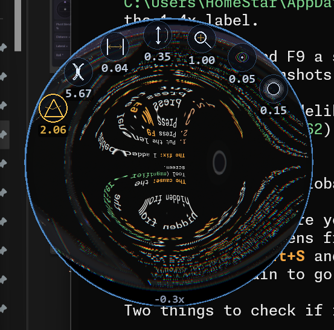
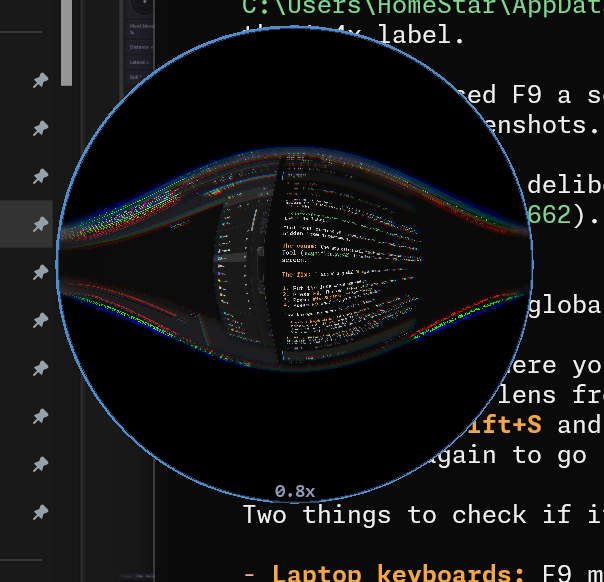

# magnify-glass

A physically-simulated magnifying glass for your screen: real optics, not just scaling.

This isn't a screen magnifier. The Windows Magnifier and tools like it crop and scale a rectangle. This is a piece of glass you hold over the screen, with everything that comes with it: warping toward the edge, colour fringing, an image that flips upside-down if you hold it too high.

A round, frameless, always-on-top lens floats over your desktop and refracts whatever is underneath it. You set the glass's refractive index, curvature, thickness and height above the screen. The lens then works out its focal length and magnification from the lensmaker's equation, so you get barrel and pincushion distortion, image inversion past the focal point, chromatic fringing and soft edges.



*Parameter icons appear around the rim when you hover near the edge. This lens has high curvature and sits past its focal point, so the image is inverted (-0.3x).*



*A strongly curved lens at 0.8x, showing heavy barrel distortion and chromatic aberration.*

## Features

- **Real lens math:** focal length comes from the lensmaker's equation for a symmetric biconvex (or biconcave) lens. Magnification comes from the lens height above the screen.
- **Radial distortion:** barrel and pincushion warping that scales with refractive index and curvature.
- **Chromatic aberration:** red and blue channels shift radially, like cheap glass.
- **Edge blur:** progressive softening toward the rim.
- **8 presets:** Reading, Loupe, Paperweight, Fish-eye, Flat, Peephole, Spoon, Globe.
- **Floating window:** round, draggable, resizable (120–800 px) and always on top.
- **Follow-cursor mode:** the lens sticks to your pointer and lets clicks pass through to whatever is underneath.
- **Remembers settings:** position, size, preset and parameters are restored on the next launch.
- **Screenshot mode:** freeze the lens so it shows up in screenshots (see below).
- **DPI aware:** works correctly on scaled displays (125%, 150%, ...).

## Requirements

- Windows (the round window, click-through region and capture exclusion use Win32 APIs)
- Python 3.8+

```
pip install pygame mss numpy
```

## Usage

```
python magnifier.py
```

The lens opens where you last left it, with your last settings. The very first time, it opens near the top-left of the screen with the **Reading** preset.

### The interface

The lens keeps its controls out of the way until you reach for them. There are three parts:

**1. The lens itself**
- Drag anywhere inside it to move it around.
- **Scroll** anywhere on it to adjust the currently selected parameter (the one with the yellow icon).
- The pill at the bottom shows the current **magnification**, e.g. `1.4x`. A negative value (`-0.3x`) means the image is upside-down because the lens is past its focal point. **Double-click the pill** to reset all parameters.

**2. Parameter icons around the rim**

Move the pointer to the outer edge of the lens and seven round icons fade in along the top arc, left to right:

| Icon | Parameter | Key |
|---|---|---|
| Prism with a light ray | refractive index (**n**) | `1` |
| Two facing arcs | curvature (**C**) | `2` |
| Two bars with an arrow | thickness (**d**) | `3` |
| Double vertical arrow | height above the screen (**H**) | `4` |
| Magnifier with `+` | zoom (**Z**) | `5` |
| Red/green/blue rings | chromatic aberration (**CA**) | `6` |
| Soft-edged rings | edge blur (**EB**) | `7` |

- Each icon shows its **current value** underneath. Hover one to see its name.
- **Scroll over an icon** to change that parameter. A fast scroll moves 3 steps at a time.
- **Click-drag an icon** for bigger changes: right or up increases, left or down decreases.
- **Click an icon** (or press its number key) to make it the *selected* parameter (yellow outline). Scrolling anywhere on the lens then adjusts it.
- **Double-click an icon** to reset just that parameter.

**3. Bottom bar**

Move the pointer to the bottom of the lens and a small bar slides in underneath:

| Control | What it does |
|---|---|
| **Red X** | Closes the magnifier |
| **Preset dropdown** (e.g. `Reading ▼`) | Picks a preset. It shows `Custom` once you've changed anything by hand |
| **Pin** checkbox | Always on top. Checked: the lens stays above every other window. Unchecked: it acts like a normal window and goes behind whatever you click next |
| **Striped corner handle** | Drag outward or inward to resize the lens (120–800 px). A dotted ring previews the new size |

### Presets

| Preset | What it's like |
|---|---|
| **Reading** | A classic reading glass. Gentle, mostly undistorted magnification. A good everyday default |
| **Loupe** | A jeweler's loupe: dense glass, tight curve, strong magnification up close |
| **Paperweight** | A heavy glass dome sitting right on the page. Thick, with a soft edge |
| **Fish-eye** | Extreme curvature. Everything bulges and bends around the edge |
| **Flat** | Nearly flat glass. Almost no optical effect, useful for comparison or plain zoom |
| **Peephole** | A concave door-viewer lens. Shrinks things and shows a wide view |
| **Spoon** | Looking into the back of a spoon: concave and warped |
| **Globe** | A strongly concave, heavily zoomed lens with lots of fringing |

"Reset" (double-click, or `R`) goes back to whichever preset you picked last.

### Tips

- **High curvature is hard to work through.** Strong curves warp everything except the exact centre, and past the focal point the image flips, so moving the mouse right makes the content slide left. That's what real glass does. For actually getting work done, use **Reading** or **Loupe**, and keep the extreme presets for fun.
- **Watch the height (H).** Raising it towards the focal length makes magnification shoot up. Go past it and the image inverts. The magnification readout tells you which side you're on.
- **Follow mode + Reading preset** is the most practical combination: a gentle magnifier that sits on your pointer while you keep clicking and typing normally.
- **Edge blur is scaled down on purpose.** At `1.00` it's already fairly soft, and more than that looked bad.

### Controls reference

| Action | How |
|---|---|
| Move the lens | Click and drag anywhere inside it |
| Show parameter icons | Hover near the rim |
| Adjust a parameter | Scroll over its icon, or click-drag the icon (left/right or up/down) |
| Adjust the selected parameter | Scroll anywhere on the lens |
| Select a parameter | Click its icon, or press `1`–`7` |
| Reset one parameter | Double-click its icon |
| Reset everything | Double-click the magnification readout, or press `R` |
| Presets / pin (always on top) / close | Hover the bottom of the lens to show the bottom bar |
| Resize | Drag the striped handle at the right of the bottom bar |
| Follow cursor on/off | `F8` with the pointer over the lens |
| Screenshot mode on/off | `F9` with the pointer over the lens |
| Quit | `Esc` or the red X in the bottom bar |

`F8` and `F9` work even when the lens doesn't have focus, but only while the pointer is over it, so the same keys in other apps (e.g. "toggle breakpoint") don't trigger them. Number keys, `R` and `Esc` need the lens to be focused (click it once).

### Follow-cursor mode

Press `F8` over the lens and it centres on your pointer and moves with it. While following, the lens is click-through: clicks, scrolling and typing go to the app underneath, and the icons and bottom bar are hidden. Press `F8` again to stop. Since the pointer is always over the lens in this mode, `F8` always works to get out.

### Saved settings

Position, size, parameters, the last preset and the pin state are saved to `%APPDATA%\magnify-glass\settings.json` about a second after you change them. Closing the terminal doesn't lose them. If the saved position is off-screen (e.g. a disconnected monitor), the lens is pulled back onto the desktop. Delete the file to start fresh.

### Parameters

| # | Icon | Parameter | Range | Effect |
|---|---|---|---|---|
| 1 | Prism | **n**: refractive index | 1.0 – 3.0 | Stronger bending, shorter focal length |
| 2 | Arcs | **C**: curvature (1/R) | -20 – 20 | Positive = convex (magnifies), negative = concave (shrinks) |
| 3 | Bars | **d**: thickness | 0 – 1 | Thick-lens correction to focal length |
| 4 | Arrow | **H**: height above screen | 0.01 – 5 | Near the focal point magnification spikes; past it the image flips |
| 5 | Magnifier | **Z**: zoom | 0.2 – 5 | Extra digital zoom on top of the optics |
| 6 | RGB rings | **CA**: chromatic aberration | 0 – 2 | Color fringing toward the edge |
| 7 | Rings | **EB**: edge blur | 0 – 1 | Softness toward the rim |

The live magnification (optics × zoom) is shown at the bottom of the lens. A negative value means the image is inverted.

## Taking screenshots of the lens

The lens hides itself from all screen capture (`WDA_EXCLUDEFROMCAPTURE`) so that it doesn't magnify its own window. That also hides it from the Snipping Tool and other screenshot apps.

To capture it:

1. Put the lens where you want it.
2. With the pointer over the lens, press **F9**. The lens freezes on its current image and becomes visible to capture.
3. Take your screenshot (e.g. **Win+Shift+S**).
4. Hover the lens and press **F9** again to go back to the live lens.

On some laptops you may need **Fn+F9**.

## License

MIT, see [LICENSE](LICENSE).
